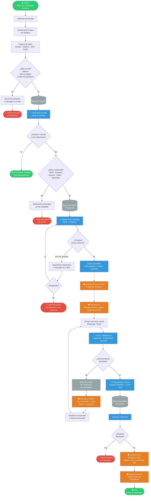

# 📋 ECOSISTEMA CRM n8n — PROFORMA V4.1
### Documento Maestro Integrado · Actualización y Verificación de Completitud
> **Versión:** V4.1 consolidada con correcciones operativas del diagrama final  
> **Fuentes:** Manual Maestro de Operación (Agente de IA) + Documento Integrado CRM n8n  
> **Última revisión:** Junio 2026  

---

## ÍNDICE

1. [Propósito y Alcance](#1-propósito-y-alcance)
2. [Arquitectura del Ecosistema](#2-arquitectura-del-ecosistema)
3. [Diagrama de Flujo Operativo Completo](#3-diagrama-de-flujo-operativo-completo)
4. [Módulo I — Captación, Triaje y Recuperación](#4-módulo-i--captación-triaje-y-recuperación)
5. [Módulo II — OCR Hoja Amarilla y Calificación Financiera](#5-módulo-ii--ocr-hoja-amarilla-y-calificación-financiera)
6. [Módulo III — Agente de IA, Asignación y Cita Humana](#6-módulo-iii--agente-de-ia-asignación-y-cita-humana)
7. [Módulo IV — Auditoría Documental e Incidencias](#7-módulo-iv--auditoría-documental-e-incidencias)
8. [Módulo V — Empaquetado, Dictamen y Cierre](#8-módulo-v--empaquetado-dictamen-y-cierre)
9. [Guion de Llamada del Agente de IA](#9-guion-de-llamada-del-agente-de-ia)
10. [Documentación Requerida — Políticas Estrictas](#10-documentación-requerida--políticas-estrictas)
11. [Repositorios y Bases de Datos](#11-repositorios-y-bases-de-datos)
12. [Payload Maestro (Estructura JSON)](#12-payload-maestro-estructura-json)
13. [Base de Conocimiento — 50 FAQs](#13-base-de-conocimiento--50-faqs)
14. [Checklist de Verificación de Completitud](#14-checklist-de-verificación-de-completitud)

---

## 1. Propósito y Alcance

### Propósito
Digitalizar, clasificar, asignar, auditar y cerrar expedientes de pensión mediante **n8n**, **IA**, **OCR**, **WhatsApp**, **Google Sheets** y **Google Drive**, eliminando criterios informales y excepciones manuales — cada paso queda trazado en base de datos o en nodo de flujo.

### Alcance
| Etapa | Descripción |
|---|---|
| **Captación** | Meta Ads / WhatsApp Business |
| **Validación** | NSS / CURP, identificación pasiva |
| **Calificación** | OCR de hoja amarilla, matriz binaria financiera |
| **Contacto IA** | Llamadas automáticas 08:00–19:00 hrs |
| **Asignación** | Round-robin a 6 agentes humanos |
| **Auditoría documental** | OCR de documentos escaneados vía bot |
| **Empaquetado** | Drive estructurado por [NOMBRE][CURP][NSS] |
| **Dictamen** | Financiero, aprobación/rechazo |
| **Cierre** | Foto biométrica final + cobro de honorarios |

### Regla Documental Crítica
> ⚠️ **Los documentos se aceptan ÚNICAMENTE escaneados por escáner. Las fotografías de celular se rechazan como incidencia documental sin excepción.**

> 📌 **La foto biométrica (selfie con INE) se solicita SOLO al final, una vez aprobado el expediente por la financiera.**

---

## 2. Arquitectura del Ecosistema

```
Meta Ads / WhatsApp Business
          │
          ▼
   [BASE DE CAPTURA]
   NSS · Teléfono · Nombre
          │
          ▼
   OCR Hoja Amarilla
   (6 variables extraídas)
          │
     ┌────┴────┐
     ▼         ▼
[NÓMINA]  [DOMICILIADO]   ──→  NO APTO (banco no autorizado)
     │         │
     ▼         ▼
  Flujo   Agente IA
 indep.  (Llama 08-19h)
              │
              ▼
    Round-Robin → 6 Agentes Humanos
              │
              ▼
      Cita de Inicio
              │
              ▼
    Carga Documental (Bot OCR)
              │
         ┌────┴────┐
         ▼         ▼
    APROBADO    RECHAZADO
         │    (Incidencias)
         ▼
   Empaquetado Drive
         │
         ▼
   Dictamen Financiero
         │
    ┌────┴────┐
    ▼         ▼
APROBADO  DESAPROBADO
    │
    ▼
Foto Biométrica Final
    │
    ▼
Agente de Cierre → Cobro
```

---

## 3. Diagrama de Flujo Operativo Completo



**Leyenda de colores:**
| Color | Significado |
|---|---|
| 🟢 Verde | Inicio / Éxito / Cierre |
| 🔵 Azul | Sistema n8n / IA / OCR |
| 🟠 Naranja | Intervención Humana |
| 🔴 Rojo | Descarte / No Apto |
| ⚪ Gris | Bases de Datos |

---

## 4. Módulo I — Captación, Triaje y Recuperación

### Fuente de Entrada
- Meta Ads → WhatsApp Business → Webhook n8n

### Datos Capturados
| Campo | Validación | Notas |
|---|---|---|
| Nombre completo | Texto libre | Cruzar con hoja amarilla |
| Teléfono | +52XXXXXXXXXX | Identificación pasiva |
| NSS | 11 dígitos numéricos | **Parámetro principal de cruce** |
| CURP | 18 caracteres alfanuméricos | *Probable simplificación: solo NSS* |

> 📌 **Nota operativa:** Es probable que el único parámetro requerido sea el NSS de 11 dígitos. Si se confirma, el flujo de captura se simplifica considerablemente — solo se ingresa el NSS por WhatsApp y el sistema cruza con la hoja amarilla.

### Base de Captura Actual
🔗 `https://docs.google.com/spreadsheets/d/1Ke2dLc3HqwsqfpYRPiv6AANndBj30bXmCr4WLXjGPN4/edit`

### Flujo de Recuperación
```
Cliente abandona sin completar datos
         │
         ▼
Bucle: 4 mensajes de seguimiento en 3 días
         │
    ¿Responde?
    /        \
  Sí          No
   │           │
Reintegra   Descarte por
al flujo    abandono
```

---

## 5. Módulo II — OCR Hoja Amarilla y Calificación Financiera

### Variables Extraídas por OCR (6)
1. Nombre completo
2. CURP
3. NSS (11 dígitos — integrado del input previo)
4. Monto de pensión
5. Banco
6. Presencia/ausencia de retenciones

### Matriz de Calificación Binaria

#### 5.1 Perfil NÓMINA
| Criterio | Valor requerido |
|---|---|
| Pensión | > $5,000 MXN |
| Retenciones | Cero |
| Banco | Cualquier institución |
| **Destino** | **Base Nómina · Flujo independiente** |

#### 5.2 Perfil DOMICILIADO
| Criterio | Condición |
|---|---|
| Retenciones activas | Sin importar monto de pensión |
| O pensión < $5,000 | Sin retenciones |
| Banco autorizado | BBVA · Banamex · Banorte · HSBC · Santander |

> ⚠️ **Regla clave:** Si el prospecto tiene retenciones Y banco autorizado → es apto como Domiciliado, **sin importar el monto de pensión.**

#### 5.3 NO APTO
- Perfil Domiciliado pero banco **no** está en los 5 autorizados.
- Se envía notificación automática de no viabilidad y se cierra el registro.

### Base Domiciliado Enriquecida (referencia)
🔗 `https://docs.google.com/spreadsheets/d/1afFUEBcGUaelpgtpxVAPEDcDOiI5Up9kjMZtVwIPbI/edit`

**Campos:** Nombre completo · CURP · NSS · Banco · Monto pensión · Retenciones · Resultado OCR · Teléfono

---

## 6. Módulo III — Agente de IA, Asignación y Cita Humana

### Reglas del Agente de IA
| Parámetro | Valor |
|---|---|
| Ventana de llamadas | 08:00 – 19:00 hrs |
| Duración objetivo | Máximo 7 minutos |
| Fuente única de entrada | Base Domiciliado Enriquecida |
| Salida única | Round-robin → agente humano |

> ⚠️ **Restricción crítica:** El agente de IA NO se conecta directo con agentes humanos ni con auditoría documental. Su único objetivo es el contacto inicial y la agenda de cita humana.

### Comportamiento de la IA
- Se limita a lo esencial: explicar el beneficio, aclarar que no hay costo por adelantado, y obtener confirmación.
- En los **últimos 30 segundos** pregunta si desea ser contactado por un asesor humano a la brevedad.
- Si el cliente habla de temas no críticos, se agenda cita humana.
- Si la comunicación es ininteligible → observación registrada → se manda a asesor humano.
- **Entre asesores humanos NO hay visibilidad cruzada de leads.**

### Seguimiento Post-Llamada
```
IA no logra contacto o cliente no confirma
              │
              ▼
  4 mensajes de seguimiento automático
              │
         ¿Responde?
        /           \
      Sí              No
       │               │
  Ruta positiva    Descarte por
  (reincorpora)    abandono
```

### Asignación Round-Robin
- 6 agentes humanos disponibles.
- El agente asignado es **propietario permanente del lead**.
- El sistema envía automáticamente: PDF de la empresa + imagen de requisitos.

### Cita de Inicio (Agente Humano)
**Propósito:** Transición entre interés confirmado y carga formal de expediente.

Acciones del agente en la cita:
1. Entregar manualmente el contrato.
2. Indicar el número/canal exacto para envío documental (WhatsApp bot).
3. Explicar que los documentos deben ser **escaneos por escáner únicamente**.
4. Aclarar que no se aceptan: fotografías de celular · capturas de pantalla · documentos borrosos · recortados · incompletos.
5. Enviar al cliente al flujo de carga documental vía bot.

**Guion sugerido:**
> *"Señor/señora, para poder avanzar con su expediente, los documentos deben enviarse únicamente escaneados por escáner. No se aceptan fotografías tomadas con celular. Si un documento llega como foto, borroso, recortado o incompleto, el sistema lo rechazará y se le indicará exactamente qué debe corregir."*

---

## 7. Módulo IV — Auditoría Documental e Incidencias

> 📌 **Principio:** La auditoría la realiza el **bot**, no el asesor. El asesor no valida documentos por fuera del sistema (rompe la trazabilidad).

### 7.1 Documentos Auditados

| Documento | Criterio de aceptación | Prioridad |
|---|---|---|
| **INE** | Ambos lados · escaneada · legible · completa · sin recortes · sin reflejos | 🔴 CRÍTICO |
| **Estados de cuenta** | Últimos 2 meses consecutivos · escaneados · completos · legibles | 🔴 CRÍTICO |
| **Resumen de movimientos** | Rango 60 días · movimientos completos · escaneado · legible · del banco correcto | 🔴 CRÍTICO |
| **Comprobante de domicilio / CFE** | Máx. 3 meses de antigüedad · completo · escaneado · legible | 🟡 IMPORTANTE |
| **Resolución de pensión IMSS** | Completa · escaneada · legible · sin páginas faltantes ni márgenes cortados | ⚪ No crítico (solo pasa como válido) |

> ⚠️ **Caducidad de resumen de movimientos:** Se toma como caducado **2 días** después de ser expedido. Debe estar actualizado al momento de la subida.

> 📌 **El resumen de movimientos debe pertenecer al banco del lead especificado en la hoja amarilla.**

### 7.2 Regla Especial — Foto Biométrica
La **foto sosteniendo INE** NO se solicita en la primera carga documental.  
Se solicita **únicamente al final**, después de aprobación financiera.  
Razón: evitar mezclar documentos escaneados con una fotografía que por naturaleza no puede ser escáner.

### 7.3 Motivos de Rechazo Documental
| Motivo | Descripción |
|---|---|
| Foto de celular | El documento fue enviado como fotografía, no escaneo |
| No escaneado | No proviene de escáner físico |
| Borroso / recortado / incompleto | Calidad insuficiente para lectura OCR |
| Comprobante vencido | Antigüedad mayor a 3 meses |
| Estados de cuenta no consecutivos | No cubren los 2 periodos más recientes |
| Resumen insuficiente | No cubre los 60 días requeridos |
| Identidad no coincide | Nombre no coincide con INE, resolución IMSS o registro inicial |
| Banco incorrecto | Resumen de movimientos no pertenece al banco del lead |

> ⚠️ **El rechazo debe ser ESPECÍFICO por documento, nunca genérico.** Un rechazo genérico genera confusión; una razón exacta genera corrección.

### 7.4 Base de Incidencias Documentadas

| Campo | Descripción |
|---|---|
| ID lead | Identificador único del prospecto |
| Cliente | Nombre del cliente |
| Asesor propietario | Agente humano asignado |
| Documento rechazado | INE · CFE · Resolución · Estado de cuenta · Resumen |
| Motivo | Foto · No escaneado · Borroso · Vencido · Incompleto · No consecutivo · Banco incorrecto |
| Intento OCR | 1° · 2° · 3° intento |
| Mensaje enviado | Plantilla de rechazo utilizada |
| Estatus | Pendiente · Corregido · Reincidente · Escalado |
| Acción siguiente | Reintento documental o cita de corrección |

### 7.5 Ejemplos de Paquetes Correctos (Drive)
Carpetas de referencia para verificar calidad de escaneo, legibilidad y periodos bancarios:
- 🔗 `https://drive.google.com/drive/folders/1SbQg0RWVqoqVRHpwNmYAkkpy5HAQkXq3`
- 🔗 `https://drive.google.com/drive/folders/1CvafPZHkanMGS4sgibYJGm8Wz2kqvlWw`
- 🔗 `https://drive.google.com/drive/folders/11pgXGbJkveCPxUc-jvHKASmJrHH2pue_`
- 🔗 `https://drive.google.com/drive/folders/1Mj3EkAtt-gHxAPGdG8HE6SkZRJO_-RWg`
- 🔗 `https://drive.google.com/drive/folders/1q--HuxcGpcXidAV3nlnaq8xFQaBaehs3`

### 7.6 Ejemplos de Resúmenes por Banco
| Banco | Carpetas de ejemplo |
|---|---|
| **Banorte** | [Ver ejemplo 1](https://drive.google.com/drive/folders/1UQSe4PAtYmXVNSAXnOQpqhok3krCrxvL) · [Ver ejemplo 2](https://drive.google.com/drive/folders/128KKoO4Njo9b3eYExgH3SRYoG-ibRBON) · [Ver ejemplo 3](https://drive.google.com/drive/folders/1R_w-o6pl2g8h7dRnVHfGStjkSJmjNIp4) |
| **Banamex** | [Ver ejemplo 1](https://drive.google.com/drive/folders/1AP7NlV2udN-fkf0ktrOV_a6soc-KG_FQ) · [Ver ejemplo 2](https://drive.google.com/drive/folders/1eP5sgOQYBr0l7S6_lzmntM4Rsda39JCZ) |
| **BBVA** | [Ver ejemplo 1](https://drive.google.com/drive/folders/1CvafPZHkanMGS4sgibYJGm8Wz2kqvlWw) · [Ver ejemplo 2](https://drive.google.com/drive/folders/1m6jKH92AQevuie02Um3umdXHulUnuc5u) · [Ver ejemplo 3](https://drive.google.com/drive/u/2/folders/19ONKPw0n6fBMv2MKb8oC3ZM66gJeqPLS) |
| **Santander** | [Ver ejemplo 1](https://drive.google.com/drive/folders/1ZhRligc84xJQlSK6V2v7dw192_sVsTq1) · [Ver ejemplo 2](https://drive.google.com/drive/folders/1kV7Fq_MAFFQxqeSvKGfolp8C2_z_3_9M) |
| **HSBC** | Por asignar — se buscará y se mostrará |

---

## 8. Módulo V — Empaquetado, Dictamen y Cierre

### Flujo
```
Documentación Aprobada
        │
        ▼
Empaquetado en Drive
Carpeta: [NOMBRE COMPLETO] [CURP] [NSS]
        │
        ▼
Base Consolidada de Control
(URL Drive · Asesor · Estatus · Dictamen · Datos bancarios)
        │
        ▼
Dictamen Financiero
        │
   ¿Aprobado?
   /        \
  Sí          No
   │           │
Solicitud   Descarte
Foto Bío    por dictamen
Final
   │
   ▼
Agente de Cierre
   │
   ▼
🟢 Cobro de Honorarios
```

### Base Consolidada de Control — Estados del Expediente
| Estado | Descripción |
|---|---|
| `CONTACTADO` | Se logró contacto con el cliente |
| `NO_CONTACTADO` | Sin respuesta tras intentos |
| `DOCS_ENVIADOS` | Cliente envió documentación |
| `DOCS_APROBADOS` | OCR validó correctamente |
| `REQUIERE_LLAMADA_HUMANA` | Varios intentos fallidos, escalar |
| `EMPAQUETADO` | Carpeta Drive lista |
| `DICTAMEN_APROBADO` | Financiera aprobó |
| `DICTAMEN_RECHAZADO` | Financiera rechazó |
| `CERRADO` | Honorarios cobrados |

> 📌 Los estados se actualizan **automáticamente** cuando el OCR sube documentos exitosamente.

---

## 9. Guion de Llamada del Agente de IA

### Variables Dinámicas a Completar
- `[Nombre del Cliente]` — nombre completo del prospecto
- `[Primer Nombre]` — primer nombre únicamente
- `[Nombre de la Empresa]` — nombre de la empresa
- `[Institución Bancaria]` — banco del cliente (de hoja amarilla)
- `[Pensión Actual]` — monto actual de pensión
- `[Aumento]` — proyección de nuevo monto mensual

---

### Guion Completo

**[Inicio de la llamada]**

> *"Hola, muy buenos días. ¿Me comunico con don/doña **[Nombre del Cliente]**?"*

*(Esperar confirmación)*

> *"Qué gusto saludarle, don/doña **[Primer Nombre]**. Le hablo de **[Nombre de la Empresa]**. Nos comunicamos con usted respecto a la solicitud de incremento de pensión que realizó con nosotros. Antes de continuar, quiero darle una tranquilidad muy importante: nosotros no le vamos a solicitar ni un solo peso por adelantado. En ningún momento del trámite le pediremos dinero hasta que su retroactivo esté depositado y seguro en su cuenta de **[Institución Bancaria]**. ¿Me permite explicarle cómo lograremos este aumento de forma rápida y segura?"*

*(Esperar confirmación)*

> *"Perfecto. Mire, a diferencia de los abogados tradicionales que suelen alargar los trámites por meses para cobrarle honorarios constantes, nuestro proceso es muy ágil. Tarda entre 2 y 7 días como máximo. No es un juicio ni una demanda, ya que el IMSS cuenta con un amparo federal que lo protege. Lo que nosotros hacemos es un ajuste legal: aumentamos el promedio salarial de sus últimos 5 años trabajados, bajo un sistema muy similar a la Modalidad 40. Al elevar ese promedio, logramos que su pensión pase de los **[Pensión Actual]** que recibe hoy, a un nuevo monto mensual de aproximadamente **[Aumento]**."*

> *"Este aumento es una pensión mucho más justa para usted. Además, es un beneficio de por vida. Cada mes de febrero seguirá recibiendo su incremento por inflación, y lo más importante: esto no afecta en nada a sus dependientes económicos en caso de que usted llegue a faltar; su familia queda protegida. ¿Tiene alguna duda hasta aquí?"*

*(Esperar respuesta / Aclarar dudas breves)*

> *"Excelente. Ahora, al realizar este ajuste, el IMSS le va a otorgar un pago retroactivo, similar al que recibió cuando se pensionó por primera vez, que equivale a unos 5 meses de diferencia. De ese pago retroactivo que le caerá directamente en su cuenta, es de donde nosotros cobramos nuestra parte por el servicio (80% para la inversión de sus semanas y gestión, 20% libre para usted). Le repito: usted no nos paga absolutamente nada hasta que ese dinero ya esté en sus manos."*

> *"Para poder avanzar y actualizar su expediente, le voy a enviar por WhatsApp una lista detallada de documentos. Es muy importante que nos los envíe escaneados para que no haya ningún retraso en el sistema, ya que el IMSS no acepta fotografías. Además de los documentos, vamos a necesitar que nos envíe una fotografía suya sosteniendo su INE junto a su rostro, y que nos grabe un video corto y sencillo (o en su defecto, la firma de un contrato). En ese video o contrato, usted solo nos confirmará de viva voz o por escrito que está de acuerdo con el trámite y el aumento."*

> *"No se preocupe por la foto o el video, yo le voy a ayudar en todo. Al terminar esta llamada le mandaré por mensaje exactamente las instrucciones y ejemplos de cómo debe enviar cada cosa. ¿Cuenta con alguien en casa que le pueda ayudar a tomarse esta foto, grabar el video, o escanear sus documentos en un cibercafé?"*

*(Esperar respuesta)*

> *"Perfecto, don/doña **[Primer Nombre]**. Recuerde que nuestro compromiso en **[Nombre de la Empresa]** es brindarle un servicio seguro, rápido y transparente. En un momento le envío toda la información a este número y un compañero de otra área se comunicará con usted para iniciar el trámite formalmente y ratificarle su monto. Quedo a sus órdenes y le deseo un excelente día."*

---

### Instrucción para el Agente de IA — Manejo del Aumento Tentativo
> Si el cliente exige exactitud al centavo, la IA debe indicar:  
> *"La cantidad que le mencioné es una proyección con 90% de seguridad basada en sus semanas. En el siguiente paso mi compañero analista le ratificará la cifra final exacta."*

---

## 10. Documentación Requerida — Políticas Estrictas

> ⚠️ **DIRECTRIZ CRÍTICA:** NO se aceptan fotografías de documentos bajo NINGUNA circunstancia. Todos los documentos deben ser escaneos ordenados y 100% legibles.  
> **ÚNICA excepción:** fotografía de validación de identidad (Selfie con INE), solicitada al FINAL del proceso.  
> **No se requiere CLABE interbancaria** — ya se cuenta con ella en la base de datos.

| # | Requisito | Formato / Condición | Instrucción Específica |
|---|---|---|---|
| 1 | **INE** | Escaneo PDF · ambos lados | 100% legible, sin recortes ni reflejos |
| 2 | **Foto con INE** | Fotografía JPG/PNG | Sosteniendo INE a la altura del rostro · Se enviará ejemplo por WhatsApp |
| 3 | **Resumen de Movimientos** | Escaneo PDF | Últimos 60 días · Del banco correcto del lead · Se enviará ejemplo por banco |
| 4 | **Resolución de Pensión** | Escaneo PDF | Documento original de resolución inicial |
| 5 | **Correo Electrónico** | Dato escrito | Correo activo para recibir nueva constancia |
| 6 | **Video Convenio / Contrato** | Video MP4 o PDF firmado | Confirmación de viva voz o por escrito del acuerdo con el trámite |
| 7 | **Estado de Cuenta** | Escaneo PDF | Últimos 2 periodos consecutivos · Descargable desde app o banco |
| 8 | **Comprobante de Domicilio** | Escaneo PDF | Máximo 3 meses de antigüedad · Puede ser: luz, agua o telefonía fija |

---

## 11. Repositorios y Bases de Datos

| Base | Función | Campos Clave |
|---|---|---|
| **Base de Captura** | Recibe datos iniciales validados | Nombre · Teléfono · NSS · CURP · Fecha/hora · Campaña |
| **Base Nómina** | Casos con pensión > $5,000 y cero retenciones | Nombre · NSS · CURP · Monto · Banco · Estatus |
| **Base Domiciliado Enriquecida** | Casos viables por banco y regla Domiciliado → alimenta agente IA | Nombre · CURP · NSS · Banco · Monto · Retenciones · OCR · Teléfono |
| **Base de Incidencias Documentadas** | Registra rechazos documentales | Doc rechazado · Motivo · Intento OCR · Asesor · Mensaje · Estatus |
| **Base Consolidada de Control** | Expedientes aprobados para dictamen | URL Drive · Asesor · Estatus · Dictamen · Datos bancarios |

---

## 12. Payload Maestro (Estructura JSON)

```json
{
  "prospecto_identificacion": {
    "origen": "Meta Ads / WhatsApp Business",
    "nombre_completo": "TEXTO_STRICT",
    "telefono": "+52XXXXXXXXXX",
    "curp": "AAAA000000AAAAAA00",
    "nss": "00000000000"
  },
  "calificacion_financiera": {
    "monto_pension": 0,
    "banco": "BBVA / Banamex / Banorte / HSBC / Santander",
    "retenciones": true,
    "perfil": "NOMINA / DOMICILIADO / NO_APTO",
    "banco_autorizado": true
  },
  "operacion": {
    "base_actual": "Base Domiciliado enriquecida",
    "asesor_propietario": "ID_ASESOR",
    "estado": "IA / CITA_INICIO / OCR / EMPAQUETADO / DICTAMEN",
    "contador_seguimiento": 0
  },
  "auditoria_documental": {
    "ine": "Aprobado / Rechazado",
    "cfe": "Aprobado / Rechazado",
    "resolucion_imss": "Aprobado / Rechazado",
    "estados_cuenta_2_meses": "Aprobado / Rechazado",
    "resumen_movimientos_60_dias": "Aprobado / Rechazado",
    "match_identidad": true,
    "incidencias": []
  },
  "cierre": {
    "url_drive": "https://drive.google.com/...",
    "dictamen_financiero": "Aprobado / Desaprobado",
    "foto_biometrica_final": "Pendiente / Aprobado",
    "honorarios_cobrados": true
  }
}
```

---

## 13. Base de Conocimiento — 50 FAQs

### A. Seguridad y Confianza

**1. ¿Cómo sé que no es un fraude o extorsión?**
> "Comprendo su inquietud. Le doy la mayor garantía: no le pedimos absolutamente nada de dinero por adelantado. Además, firmaremos un contrato especificando que no pagará ni un peso hasta que su dinero esté seguro en su cuenta."

**2. ¿Dónde están sus oficinas? Me gustaría ir en persona.**
> "Con mucho gusto. Nuestras oficinas están en Tuxtla Gutiérrez, Chiapas. Podemos llevar su trámite de manera presencial o a distancia."

**3. ¿Cómo consiguieron mis datos?**
> "Usted mismo nos compartió amablemente su Número de Seguridad Social y su CURP hace unos días por WhatsApp. Con eso hicimos la proyección."

**4. ¿Me van a mandar la información de su empresa?**
> "Por supuesto. Le haremos llegar nuestra acta constitutiva, comprobante de domicilio y la identificación de nuestro representante legal."

**5. ¿Me van a pedir mi NIP, mi contraseña o mi CLABE interbancaria?**
> "¡Nunca! Jamás comparta su NIP ni su contraseña. Nosotros nunca le pediremos esos datos ni los necesitamos, ya que su cuenta bancaria ya está vinculada en el sistema donde el IMSS le deposita mes con mes."

---

### B. Costos, Inversión y Pago del Retroactivo

**6. ¿Qué porcentaje me van a cobrar del retroactivo?**
> "Cobramos el 80% y usted recibe el 20%. Suena alto, pero nosotros ponemos el dinero de inversión para cubrir los huecos en sus semanas cotizadas y mejorar su promedio salarial."

**7. ¿Cómo les voy a pagar su parte?**
> "Una vez que verifique que el dinero ya cayó en su cuenta, solo tendrá que hacernos un depósito o transferencia a la cuenta oficial de la empresa."

**8. ¿Cuánto tiempo tengo para pagarles su 80% una vez que el banco me libere el dinero?**
> "Una vez que el retroactivo esté reflejado en su cuenta, usted cuenta con un lapso máximo de 5 horas para realizar la transferencia. Es importante por los cortes de nuestro sistema de inversión."

**9. ¿Por qué tengo solamente 5 horas para hacerles el depósito? Me muevo despacio.**
> "Lo entendemos. Esto se debe a que debemos recuperar y cerrar el ciclo de la inversión de capital que hicimos el mismo día que a usted le paga el IMSS. Le avisaremos con tiempo para que se organice con calma."

**10. Mi banco a veces no me deja hacer transferencias grandes, ¿qué pasa si me tardo más de las 5 horas?**
> "Mi compañero estará en la línea con usted para guiarle y darle instrucciones de cómo autorizarlo en su aplicación o qué decirle al cajero para liberarlo a tiempo."

**11. ¿El banco no me va a retener el dinero por ser una cantidad grande?**
> "El retroactivo está programado para llegar en varios depósitos o 'tranches' más pequeños para evitar bloqueos en su banco."

**12. ¿Por qué no se cobran ustedes directamente del IMSS?**
> "Por ley, el IMSS solo le puede depositar al titular de la pensión. El dinero le cae íntegro a usted primero, y luego nos realiza el pago."

**13. ¿El SAT me va a cobrar impuestos?**
> "Nadie le va a retener impuestos. La ley protege a los pensionados."

**14. Después de pagar el 80%, ¿tengo que seguir pagando mensualidades de por vida?**
> "No. El pago es en una sola exhibición. El aumento de su pensión mensual de ahí en adelante es 100% suyo para siempre."

**15. Si el IMSS me rechaza el trámite, ¿les voy a quedar a deber dinero?**
> "El riesgo lo asumimos nosotros. Si se rechaza, usted no nos debe ni un solo peso. Solo cobramos si el trámite es exitoso."

---

### C. El Trámite y el IMSS

**16. ¿Por qué con ustedes es tan rápido (2 a 7 días)?**
> "Porque ya tenemos todo analizado. Además, trabajamos bajo un amparo federal, por lo que no hacemos juicios largos."

**17. ¿Hay riesgo de que me quiten mi pensión actual?**
> "Ningún riesgo. El trámite es tan corto que su pensión mensual no se pausa ni se interrumpe."

**18. Yo ya pagué la Modalidad 40, ¿todavía puedo subir mi pensión?**
> "¡Exactamente por eso lo contactamos! Al haber pagado la Modalidad 40, dejó abierta la posibilidad legal de compra de semanas."

**19. ¿Qué pasa si el IMSS se da cuenta? ¿Me pueden multar?**
> "No estamos haciendo nada ilegal. Todo está sustentado en la Ley 73 y amparado federalmente. No hay multas ni riesgo legal."

**20. ¿Qué hago si alguien del IMSS me llama para preguntar?**
> "Solo debe responder que está realizando una actualización de su expediente a través de su representación legal. Nosotros monitoreamos todo."

**21. Tengo un préstamo, ¿me afecta?**
> "Para nada. Este trámite se basa únicamente en sus semanas cotizadas y en su salario promedio."

**22. ¿Tengo que ir al IMSS para algo?**
> "Solo al finalizar el trámite, acudirá a su subdelegación a firmar y recoger la constancia de su nueva pensión."

**23. ¿Tengo que llevar los papeles escaneados y ya impresos a la subdelegación?**
> "No, de la integración del expediente digital nos encargamos nosotros."

**24. Ya tengo más de 75 años, ¿todavía aplico?**
> "¡Por supuesto! Este derecho no tiene límite de edad. Depende de sus años trabajados bajo la Ley 73."

**25. ¿Esta mejora también aplica para la pensión mínima garantizada?**
> "Precisamente este esquema despega su pago de esa pensión mínima y la lleva a un monto justo."

**26. ¿Tengo que estar llamando para ver cómo va el trámite?**
> "Nosotros hacemos todo el monitoreo y le avisaremos en cuanto se autorice el pago."

**27. ¿Me garantizan por escrito que mi pensión nunca va a bajar?**
> "Totalmente. En la nueva Resolución de Pensión vendrá su nuevo monto, el cual por ley nunca puede disminuir y subirá con la inflación cada febrero."

---

### D. AFORE, Vivienda y Familia

**28. ¿Ustedes se van a quedar con el dinero de mi AFORE o Vivienda?**
> "Es imposible que toquemos algo de su AFORE o Vivienda, porque ese dinero se le entregó al pensionarse. Un pensionado ya no puede sacar dinero de ahí. Nuestro trámite es exclusivamente para mejorar el pago mensual del IMSS."

**29. Si ya tengo un abogado para lo de mi AFORE, ¿choca con esto?**
> "Son trámites independientes. No chocan en absoluto."

**30. ¿El aumento de pensión hace que me suba el aguinaldo?**
> "¡Así es! Al subir su pensión mensual, su aguinaldo aumenta proporcionalmente."

**31. ¿Qué pasa si yo llego a fallecer durante el proceso?**
> "El trámite no se pierde. El beneficio pasa automáticamente a su beneficiario legal (ej. pensión de viudez). El aumento y el retroactivo quedan para su familia."

**32. ¿Mi esposa o mis hijos tienen que firmar algo o salir de avales?**
> "Para nada. Es un trámite estrictamente personal entre usted, nosotros y el IMSS."

**33. ¿Puedo dar la cuenta de banco de mi hijo para que depositen ahí?**
> "Por reglas del IMSS, el depósito debe caer forzosamente en la cuenta bancaria que está a su nombre."

---

### E. Requisitos y Logística de Documentos

**34. ¿Por qué a fuerza tienen que ser escaneados? ¿No puedo mandar fotos?**
> "Los sistemas del IMSS rechazan documentos con sombras o bordes cortados. Necesitamos escaneos ordenados y legibles para que su trámite salga rápido y no se rechace. La única excepción es la foto suya sosteniendo el INE."

**35. ¿Puedo mandarle fotos de mis documentos en lugar de escanearlos?**
> "Le ofrezco una disculpa, pero necesitamos que sean escaneados (en casa o cibercafé). Tácitamente no se aceptan fotografías de papeles."

**36. ¿Qué pasa si la foto sosteniendo mi INE sale borrosa?**
> "Mi compañero le pedirá amablemente que la volvamos a intentar hasta que los datos sean completamente legibles."

**37. En el estado de cuenta vienen mis gastos, ¿van a revisar qué compro?**
> "No revisamos sus compras. Solo necesitamos que la carátula principal muestre sus datos completos y coincida con el banco."

**38. ¿El comprobante de domicilio a fuerza tiene que ser de luz?**
> "Puede ser de agua o telefonía fija, siempre que no tenga más de 3 meses y coincida con su dirección actual."

**39. No quiero grabar el video, ¿es obligatorio?**
> "Lo podemos sustituir por un contrato físico o digital firmado por usted. Tiene la misma validez."

**40. ¿Tengo que ir con un Notario Público a certificar el contrato o video?**
> "No es necesario. El contrato privado o el video tienen total validez legal. Le ahorramos ese gasto."

**41. Yo no tengo correo electrónico, ¿qué hago?**
> "Puede pedir prestado el de un familiar, o mi compañero le ayudará a crear uno gratuito y fácil en la siguiente llamada."

---

### F. Dudas Generales y Operativas

**42. A un compadre lo estafaron pidiéndole dinero para 'copias'. ¿Seguros que no me van a pedir nada a la mitad?**
> "Le doy mi palabra y el respaldo de la empresa: no le pediremos ni un peso para copias ni notarios. Usted paga hasta que ve el dinero en su cuenta."

**43. Vivo en Estados Unidos pero recibo mi pensión en México, ¿puedo hacer el trámite?**
> "¡Claro que sí! Muchos clientes viven en el extranjero. Como el trámite es a distancia, solo necesita enviar sus escaneos y tener acceso a su banca en línea."

**44. ¿El aumento me va a llegar los mismos días que me pagan mi pensión normal?**
> "Exactamente. Le seguirá llegando los mismos días de siempre, con la misma puntualidad del IMSS."

**45. ¿Ustedes me avisan cuando caiga el retroactivo o voy a formarme al banco?**
> "En cuanto el IMSS libere el pago, el sistema nos avisa y le llamaremos inmediatamente. No tiene que hacer filas innecesarias."

**46. ¿Qué pasa si digo que sí, pero mañana me arrepiento?**
> "Si cambia de opinión antes de iniciar formalmente, no hay problema. Si el dinero retroactivo ya está en tránsito, el proceso ya no se puede detener."

**47. ¿Qué cantidad exacta de aumento voy a tener?**
> "La cantidad que le mencioné es una proyección con 90% de seguridad basada en sus semanas. En el siguiente paso mi compañero analista le ratificará la cifra final exacta."

**48. Yo recuerdo tener más semanas cotizadas de las que dice mi reporte.**
> "Esa es una excelente observación técnica. Mi compañero, que es el analista asignado, tiene su archivo abierto y revisará ese detalle a fondo con usted en la siguiente llamada."

**49. Mi banco actual ya no es el que ustedes me mencionaron.**
> "No se preocupe, actualizaremos ese dato en su expediente en este momento para que mi compañero lo tenga al día."

**50. Si acepto hacer el trámite ahorita, ¿qué sigue?**
> "Al finalizar, transferiré sus datos a mi compañero de gestión. Él se comunicará enseguida para explicarle los pagos, enviarle el contrato o instrucciones del video, pedirle sus documentos escaneados y arrancar oficialmente."

---

## 14. Checklist de Verificación de Completitud

Utiliza esta tabla para verificar que cada elemento del ecosistema esté implementado correctamente.

### ✅ Módulo I — Captación y Triaje

| # | Elemento | Estado |
|---|---|---|
| 1.1 | Webhook de entrada configurado (Meta Ads / WhatsApp Business) | ⬜ |
| 1.2 | Identificación pasiva de teléfono activa | ⬜ |
| 1.3 | Validación NSS (11 dígitos) implementada | ⬜ |
| 1.4 | Validación CURP (18 caracteres) implementada | ⬜ |
| 1.5 | Registro en Base de Captura funcional | ⬜ |
| 1.6 | Bucle de recuperación: 4 mensajes en 3 días | ⬜ |
| 1.7 | Lógica de descarte por abandono (sin respuesta) | ⬜ |

### ✅ Módulo II — OCR y Calificación Financiera

| # | Elemento | Estado |
|---|---|---|
| 2.1 | OCR de hoja amarilla extrae las 6 variables correctamente | ⬜ |
| 2.2 | Cruce NSS con base de ingreso para integrar teléfono | ⬜ |
| 2.3 | Clasificación Nómina (>$5K · 0 retenciones) funcional | ⬜ |
| 2.4 | Clasificación Domiciliado (retenciones + banco autorizado) funcional | ⬜ |
| 2.5 | Los 5 bancos autorizados correctamente configurados | ⬜ |
| 2.6 | Ruta "No Apto" con notificación automática activa | ⬜ |
| 2.7 | Base Domiciliado Enriquecida poblada correctamente | ⬜ |

### ✅ Módulo III — Agente de IA y Asignación

| # | Elemento | Estado |
|---|---|---|
| 3.1 | Agente de IA llama solo dentro de ventana 08:00–19:00 | ⬜ |
| 3.2 | Guion cargado con todas las variables dinámicas | ⬜ |
| 3.3 | Duración máxima de llamada ~7 minutos configurada | ⬜ |
| 3.4 | Pregunta de handoff en últimos 30 segundos activa | ⬜ |
| 3.5 | Registro de respuesta (sí/no al asesor humano) | ⬜ |
| 3.6 | Seguimiento: 4 mensajes automáticos si no contesta | ⬜ |
| 3.7 | Round-robin a 6 agentes humanos configurado | ⬜ |
| 3.8 | Visibilidad cruzada entre asesores BLOQUEADA | ⬜ |
| 3.9 | Envío automático de PDF empresa + imagen requisitos | ⬜ |
| 3.10 | Asignación permanente de propietario del lead | ⬜ |

### ✅ Módulo IV — Auditoría Documental

| # | Elemento | Estado |
|---|---|---|
| 4.1 | Bot recibe documentos vía WhatsApp | ⬜ |
| 4.2 | OCR valida legibilidad, temporalidad e identidad | ⬜ |
| 4.3 | Rechazo de fotos de celular (no escaneos) activo | ⬜ |
| 4.4 | Rechazo de INE borrosa/cortada activo | ⬜ |
| 4.5 | Validación estados de cuenta consecutivos (2 meses) | ⬜ |
| 4.6 | Validación resumen de movimientos 60 días | ⬜ |
| 4.7 | Validación banco del resumen = banco del lead | ⬜ |
| 4.8 | Caducidad resumen: 2 días tras expedición | ⬜ |
| 4.9 | Validación comprobante de domicilio ≤ 3 meses | ⬜ |
| 4.10 | Match de identidad entre documentos | ⬜ |
| 4.11 | Mensajes de rechazo específicos por documento (no genéricos) | ⬜ |
| 4.12 | Registro automático en Base de Incidencias Documentadas | ⬜ |
| 4.13 | Foto biométrica NO solicitada en primera carga (solo al final) | ⬜ |
| 4.14 | Ejemplos de resúmenes por banco cargados en el sistema | ⬜ |

### ✅ Módulo V — Empaquetado y Cierre

| # | Elemento | Estado |
|---|---|---|
| 5.1 | Empaquetado Drive con nomenclatura [NOMBRE][CURP][NSS] | ⬜ |
| 5.2 | Traspaso automático a Base Consolidada de Control | ⬜ |
| 5.3 | Actualización automática de estados en Base Consolidada | ⬜ |
| 5.4 | Flujo de dictamen financiero activo | ⬜ |
| 5.5 | Ruta de descarte por dictamen rechazado activa | ⬜ |
| 5.6 | Solicitud de foto biométrica final post-dictamen aprobado | ⬜ |
| 5.7 | Agente de cierre asignado para gestión final | ⬜ |
| 5.8 | Registro de cobro de honorarios | ⬜ |

### ✅ General del Sistema

| # | Elemento | Estado |
|---|---|---|
| G.1 | Payload maestro JSON implementado en todos los nodos | ⬜ |
| G.2 | Todas las bases de datos con campos correctos y funcionales | ⬜ |
| G.3 | Guion del agente de IA con las 50 FAQs cargado | ⬜ |
| G.4 | Plantillas de WhatsApp por motivo de rechazo creadas | ⬜ |
| G.5 | Ningún expediente avanza por criterio informal o excepción manual | ⬜ |
| G.6 | Trazabilidad completa en base de datos en cada paso | ⬜ |
| G.7 | Base de Incidencias en uso activo para detección de patrones | ⬜ |

---

> 📝 **Próximos refinamientos recomendados:**
> 1. Crear plantillas de WhatsApp específicas para cada motivo de rechazo documental (INE borrosa · CFE vencido · estado no consecutivo · resumen incompleto).
> 2. Confirmar si el único parámetro de entrada es el NSS (11 dígitos) para simplificar el flujo de captura.
> 3. Incorporar ejemplos de resúmenes HSBC cuando estén disponibles.
> 4. Establecer alertas automáticas en Base Consolidada cuando un lead lleve más de X días sin avance.

---

*Documento generado a partir de: Manual Maestro de Operación (Agente de IA para Llamadas y WhatsApp) + Documento Integrado Ecosistema CRM n8n PROFORMA V4.1*
